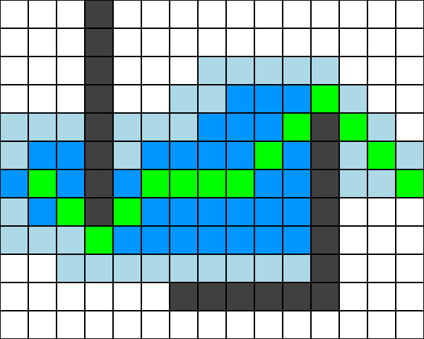

一个用来可视化最短路算法的小工具.



### 安装依赖和构建

需要先安装 [conan](https://conan.io/), 然后执行以下来安装依赖:

```bash
make install
```

然后构建:

```bash
make configure
make build
```

#### 执行

查看帮助:

```
/build/shortest-path-visulization-sdl  --help
```

可视化 `dijkstra` 算法:

```bash
 ./build/shortest-path-visulization-sdl --start 6,1 --target 6,14 dijkstra
```

可视化 `A*` 算法:

```bash
 ./build/shortest-path-visulization-sdl --start 6,1 --target 6,14 astar
```

可以按下 `ESC` 来退出.

可以按下 `Ctrl-S` 来截图, 会保存在 `screenshots` 目录.

也可以用 `--enable-screenshot` 来对每一帧截图 (注意及时退出, 免得截图太多).


地图规格 `12x15` 写死的.
